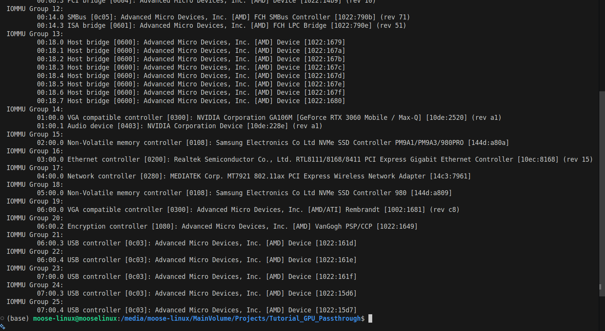
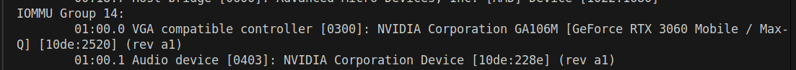
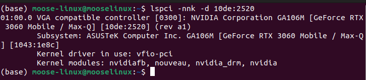
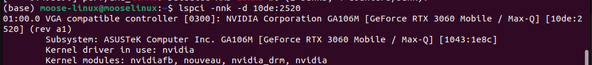
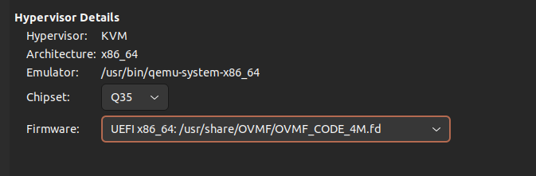

# Single GPU Passthrough Tutorial: The "Completely Free" Solution

## Overview

This is a guide based on my personal experience setting up Single GPU Passthrough on Linux. It is **not** intended to replace the [Arch Wiki](https://wiki.archlinux.org/title/PCI_passthrough_via_OVMF), which is the gold standard for this topic. Instead, this guide aims to help people who might be facing the same specific problems I did, which the Wiki doesn't cover in depth.

**Why do this?** Because let's be honest: Windows is a necessary evil for some games and software, but that doesn't mean we have to let it run our hardware. By isolating it in a VM, we keep its telemetry, forced updates, and general bloatware contained, allowing us to enjoy the freedom and stability of Linux for everything else.

Specifically, this guide targets users with **Laptop / Hybrid Graphics setups (Integrated GPU + Discrete GPU)** who want a "completely free" solution.

**My Setup Context:**
*   I am using a laptop with an Integrated GPU and a Discrete Nvidia GPU (specifically a Max-Q model, which had its own unique challenges).
*   I wanted to use the VM **without** an external monitor, dummy plug, or second keyboard/mouse.

**Key Features of this Setup:**
*   **No External Monitor Required:** We utilize **Looking Glass** to stream the VM's display directly to the Linux host's screen with near-native performance.
*   **No Dummy Plugs Required:** A purely software-based solution.
*   **No Second Keyboard/Mouse Required:** Seamless input sharing.
*   **No Second PC Required:** Everything runs on your single machine.
*   **On-Demand GPU Switching:** Includes custom scripts to automate switching the Linux host between using the Discrete GPU (for gaming/tasks) and the Integrated GPU (when the VM needs the dGPU).

## Prerequisites

*   **Hardware:**
    *   A PC/Laptop with an Integrated GPU (iGPU) AND a Discrete GPU (dGPU).
    *   **IOMMU & Virtualization Support:**
        *   Your CPU must support hardware virtualization (VT-x/AMD-V) and IOMMU (VT-d/AMD-Vi).
        *   Your motherboard must support IOMMU.
        *   Your guest GPU ROM must support UEFI.
        *   *Please refer to the [Arch Wiki Prerequisites](https://wiki.archlinux.org/title/PCI_passthrough_via_OVMF#Prerequisites) for a detailed list of compatible hardware and how to verify support.*
*   **Software:**
    *   A Linux distribution. **Note:** This tutorial was performed on **Ubuntu**, but the concepts apply to any distro. I still recommend referring to the Arch Wiki for distro-agnostic deep dives.
    *   Required packages (Ubuntu command):
        ```bash
        sudo apt update
        sudo apt install -y qemu-kvm qemu-utils libvirt-daemon-system libvirt-clients bridge-utils virt-manager ovmf dnsmasq ebtables
        ```

## 0. System Backup (Crucial Step)

Before messing with kernel parameters, drivers, and boot configurations, **you must create a system backup**. If something goes wrong (e.g., you blacklist your GPU and can't boot into a GUI), a snapshot will save you hours of troubleshooting.

I highly recommend using **Timeshift**.

1.  **Install Timeshift:**
    ```bash
    sudo apt install timeshift
    ```
2.  **Create a Snapshot:**
    *   Open Timeshift.
    *   Select **RSYNC** as the snapshot type (unless you are using BTRFS).
    *   Select the destination drive for your snapshots.
    *   Click **Create** to make a manual snapshot immediately.
    *   Name it something like "Pre-GPU Passthrough".

**Recovery Plan:**
If you break your system, you can boot from a Live USB, install Timeshift on the live environment, and restore this snapshot to your main drive.

## 1. IOMMU Grouping & Isolation

### 1.1 Checking IOMMU Groups
Before proceeding, it is critical to ensure your hardware supports IOMMU and that your GPU is isolated in its own group. An IOMMU group is the smallest set of physical devices that can be passed to a virtual machine. If your GPU is grouped with other critical devices (like a USB controller or PCI bridge), you must pass *all* of them to the VM, which might not be possible.

**How to check:**
1.  Run the provided script:
    ```bash
    ./scripts/iommu_group_check.sh
    ```
2.  **Analyze the output:** Look for your Discrete GPU (VGA compatible controller) and its Audio device. They should be in a group *separate* from other system devices.

    **Example of a clean IOMMU group output:**
    

**Warning: PCIe Slot Isolation**
Be wary of plugging your guest GPU into an unisolated CPU-based PCIe slot. Depending on your motherboard and CPU, the slot might be grouped with the CPU's Root Port or other devices.
*   If your GPU is grouped with other devices you cannot pass, you may need to move the GPU to another slot (if available).
*   Alternatively, you can look into the **ACS Override Patch**, but this comes with security and stability drawbacks. *Please refer to the Arch Wiki for details on ACS Override, as I have no experience with it and cannot provide support for it.*

### 1.2 Device Isolation (Binding to VFIO)

Once you have identified your GPU and Audio device in the IOMMU groups, **write down their IDs**. You will need them for the next steps.
*   Format: `VENDOR:DEVICE` (e.g., `10de:13c2`)

**Example of identifying Device IDs:**


We need to tell the Linux kernel to *ignore* these devices during boot so that the `vfio-pci` driver can claim them instead of the standard drivers (like `nouveau` or `nvidia`).

#### 1.2.1 Method 1: Using the Automated Scripts (Recommended)
I have provided two scripts in the `scripts/` folder to automate switching between "VM Mode" (GPU isolated for VM) and "Host Mode" (GPU available for Linux). This is the preferred method because manually reverting changes every time you want to use your GPU on Linux is tedious and error-prone.

**First, make the scripts executable:**
```bash
chmod +x scripts/*.sh
```

**1. Edit `scripts/boot-vm-mode.sh`**
Open this file and modify the **CONFIGURATION** section at the top to match your hardware.

```bash
# --- CONFIGURATION ---
# 1. Set your CPU IOMMU type: 'intel_iommu=on' or 'amd_iommu=on'
# 2. Replace the vfio.ids with YOUR specific GPU and Audio IDs found earlier
VFIO_GRUB_PARAMS="amd_iommu=on iommu=pt vfio-pci.ids=10de:2520,10de:228e"

# 3. Repeat the IDs here for the modprobe file
GPU_IDS="10de:2520,10de:228e"
```

**2. Edit `scripts/boot-host-mode.sh`**
This script reverses the changes. You must ensure the parameters here match exactly what you put in the VM script so they can be found and removed.

```bash
# --- CONFIGURATION ---
# Must match the values used in boot-vm-mode.sh
PARAM1="amd_iommu=on"  # or intel_iommu=on
PARAM2="iommu=pt"
PARAM3="vfio-pci.ids=10de:2520,10de:228e" # Your specific IDs
```

**3. Apply the Isolation (VM Mode)**
Run the VM mode script to update your GRUB and Initramfs, then reboot.
```bash
sudo ./scripts/boot-vm-mode.sh
sudo reboot
```

**Verification (VM Mode):**
After rebooting, your dGPU should be bound to `vfio-pci`. Run `lspci -nnk -d VENDOR:DEVICE` (e.g., `lspci -nnk -d 10de:2520`) to check.
*   **Expected Output:** `Kernel driver in use: vfio-pci`



**4. Reverting to Host Mode**
To use your GPU on Linux again (e.g., for gaming on the host), run the host mode script and reboot.
```bash
sudo ./scripts/boot-host-mode.sh
sudo reboot
```

**Verification (Host Mode):**
After rebooting, your dGPU should be bound to its standard driver (e.g., `nvidia` or `nouveau`).
*   **Expected Output:** `Kernel driver in use: nvidia` (or `nouveau`)



#### 1.2.2 Method 2: Manual Configuration
*This method involves manually editing system configuration files.*

1.  **Edit GRUB:** Open `/etc/default/grub` and add `intel_iommu=on` (or `amd_iommu=on`) and `vfio-pci.ids=YOUR_GPU_IDs (separated by commas)` to the `GRUB_CMDLINE_LINUX_DEFAULT` line.
2.  **Update GRUB:** Run `sudo update-grub`.
3.  **Configure Modprobe:** Create `/etc/modprobe.d/vfio.conf` and add:
    ```
    options vfio-pci ids=YOUR_GPU_IDs (separated by commas)
    softdep nvidia pre: vfio-pci
    ```
4.  **Update Initramfs:** Run `sudo update-initramfs -u`.
5.  **Reboot.**

**Why use the scripts?**
In order to revert the manual changes above (to use your GPU on Linux again), you would have to manually undo every edit you just made (remove params from GRUB, delete the modprobe file, update grub, update initramfs). This gets tedious very quickly. That is why I created the scripts in **Method 1**—to automate this entire process of allocating your GPU to the VM or the Host Machine.

## 2. Setting up the VM

### 2.1 Configuring Libvirt
Ok, so after doing:
```bash
sudo apt update
sudo apt install -y qemu-kvm qemu-utils libvirt-daemon-system libvirt-clients bridge-utils virt-manager ovmf dnsmasq ebtables
```

You may also need to activate the default libvirt network:

```bash
# virsh net-autostart default
# virsh net-start default
```

### 2.2 Creating the Virtual Machine
Once libvirt is installed and the network is active, you can proceed with creating the virtual machine.

1.  Open **Virtual Machine Manager** (`virt-manager`).
2.  Click the **Create a new virtual machine** icon.
3.  Choose **Local install media (ISO image or CDROM)**.
4.  Select your ISO file (e.g., Windows 10/11 installer).
5.  Configure memory and CPU settings.
6.  Create a disk image for the VM storage.
7.  **Important:** Before clicking "Finish", check the box **Customize configuration before install**.
8.  In the Overview section, change the **Firmware** to `UEFI x86_64: /usr/share/OVMF/OVMF_CODE_4M.fd` (or similar OVMF option).
    
9.  Click **Apply** and then **Begin Installation**.


